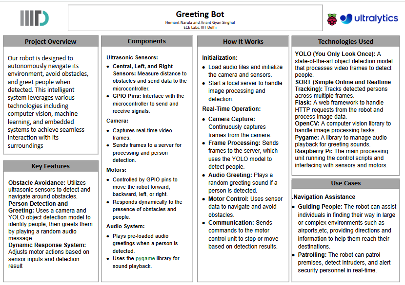

# GreetingBot

GreetingBot is a project combining a person detection and greeting system with an obstacle avoidance robot using Python and GPIO on a Raspberry Pi.

## Features

- **Person Detection**: The system detects a person using a camera and stops the robot if a person is detected.
- **Greeting**: The robot can greet a person by playing a sound.
- **Obstacle Avoidance**: The robot moves forward and avoids obstacles using ultrasonic sensors.

## Overview
</img>

## Project Structure

The project is divided into three main files:

1. `raspberrypi/camera.py`
    - Captures frames from the camera.
    - Sends frames to the server for person detection.
    - Communicates with `raspberrypi/motor.py` to stop the robot if a person is detected.

2. `raspberrypi/motor.py`
    - Controls the motors of the robot.
    - Receives messages from `raspberrypi/camera.py` to either stop or move the robot.
    - Handles obstacle avoidance using ultrasonic sensors.

3. `server/main.py`
    - Runs a Flask server to handle frame uploads.
    - Uses YOLO (You Only Look Once) for real-time object detection.
    - Sends responses back to `raspberrypi/camera.py` indicating whether a person is detected and if a greeting should be made.

## Getting Started

### Prerequisites

- Raspberry Pi
- Camera module
- Ultrasonic sensors
- Motor driver
- Python 3
- Required Python libraries: `requests`, `opencv-python`, `pygame`, `RPi.GPIO`, `socket`, `flask`, `yolov5` ,`pytourch`

### Installation

1. Clone the repository:
    ```bash
    git clone https://github.com/Hemantcoder2005/GreetingBot.git
    cd GreetingBot
    ```

2. Install the required Python libraries:
    ```bash
    pip install requests opencv-python pygame RPi.GPIO flask yolov5
    ```

### Running the Project

1. **Set up the hardware**: Connect the camera, ultrasonic sensors, and motor driver to the Raspberry Pi.

2. **Run the server**:
    ```bash
    python3 server/main.py
    ```

3. **Run the camera script**:
    ```bash
    python3 raspberrypi/camera.py
    ```

4. **Run the motor script**:
    ```bash
    python3 raspberrypi/motor.py
    ```

## How It Works

### raspberrypi/camera.py

- Initializes the camera and captures frames.
- Sends the frames to the `server/main.py` for person detection using YOLO.
- If a person is detected, sends a message to `raspberrypi/motor.py` to stop the robot.
- If the server indicates a greeting, plays a random sound.

### raspberrypi/motor.py

- Controls the motor pins using the GPIO library.
- Measures distances using ultrasonic sensors.
- Moves the robot forward and avoids obstacles.
- Receives messages from `raspberrypi/camera.py` to stop or move the robot.

### server/main.py

- Runs a Flask server that listens for incoming frame uploads from `raspberrypi/camera.py`.
- Uses the YOLO model to detect persons in the frames.
- Sends a JSON response back to `raspberrypi/camera.py` indicating whether a person is detected and if a greeting should be made.

## Troubleshooting

### Common Issues

1. **Camera not found**:
    - Ensure the camera is properly connected.
    - Verify that the camera module is enabled in the Raspberry Pi configuration.

2. **Motors not working**:
    - Check the motor driver connections.
    - Verify the GPIO pin setup.

3. **Ultrasonic sensor giving incorrect readings**:
    - Ensure the sensors are properly connected.
    - Check the trigger and echo pin configurations.

4. **Server not responding**:
    - Ensure that `server/main.py` is running.
    - Check the network connection between the Raspberry Pi and the server.

## Contributors
- [Hemant Narula](https://github.com/Hemantcoder2005)
- [Anant Gyan Singhal](https://github.com/c0smicsage)

## Contributing

Contributions are welcome! Please fork the repository and create a pull request with your changes.

## Skills required
1. Python(+circuit python)
2. CV
3. ML
4. 3d Modeling


## Acknowledgments

- This project was inspired by the need for a responsive and interactive robot capable of detecting and greeting people while avoiding obstacles.
